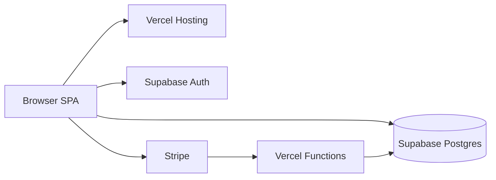

# Publication plan (for later)

Status: **deferred for public freemium** — personal email sign-in + sync editing is implemented (see [`SETUP.md`](SETUP.md)). Stripe / multi-user productization still deferred.

Goal: turn this static start page into a public freemium product with personalized bookmarks that sync across devices.

## Stack

| Layer | Choice | Why |
|---|---|---|
| Frontend | Evolve `index.html` into a **Vite SPA** or thin **Next.js** app on **Vercel** | Easy deploys, previews, custom domain; SPA is enough for a start page |
| Backend | Prefer **Supabase client + RLS** from the browser; add **Vercel Route Handlers / Serverless Functions** only for Stripe webhooks and secrets | Avoids a custom API for most CRUD |
| Database | **Supabase Postgres** | Auth-integrated; RLS isolates each user’s rows |
| Auth | **Supabase Auth** — **email + password** (Google deferred for public launch if desired) | Simple accounts without OAuth app setup |
| Payments | **Stripe Checkout** (subscription + optional lifetime later) | Freemium first; flip gates to paid-only if costs rise |

**Cost reality:** Early public usage often fits free tiers (Vercel Hobby + Supabase Free). The first meaningful cliff is usually **Supabase Pro (~$25/mo)** if you outgrow free DB/auth limits — plan for Pro revenue to cover that, or tighten free caps / require Pro for sync.



## Product model (freemium)

**Free**
- Sign in with email + password
- Sync bookmarks across devices
- Cap: e.g. **80 bookmarks** and **8 sections** (tune later)
- Default theme only

**Pro** (monthly ~$2–4 or yearly; optional lifetime later)
- Unlimited bookmarks/sections
- Import/export JSON
- Extra themes / denser layouts later

If upkeep exceeds free tiers and Pro conversion is low, flip the gate: **sync requires Pro** and keep a local-only free mode (no account).

## Data model

Use Supabase Auth’s `auth.users`; add app tables with **RLS** so `auth.uid()` owns all rows:

- `profiles` — `id` (FK to `auth.users`), email, `plan` (`free` | `pro`), `stripe_customer_id`
- `sections` — id, user_id, name, sort_order
- `bookmarks` — id, section_id, user_id, title, url, initials, sort_order

RLS policies: `SELECT/INSERT/UPDATE/DELETE` only where `user_id = auth.uid()`.

Enforce free caps with a DB trigger or a small server function (do not trust UI-only checks). Stripe webhook (Vercel function with service role) updates `profiles.plan`.

**Client load path:** after session, fetch sections + bookmarks once; edit in UI; debounce writes via Supabase client. Cache in `localStorage` as offline read cache only; server remains source of truth when signed in.

## Evolution from today’s app

Today’s static `BOOKMARKS` object in `index.html` becomes:

1. **Signed-out:** empty or starter defaults + “Sign in to sync”
2. **Signed-in:** load tree from Supabase; restore in-app add/edit/delete (no Gist)
3. **Import:** “Import from JSON” for the old gist-shaped export

UI keeps the current start-page look (search, filter, clock, sections) plus a compact account menu (avatar, plan badge, Sign out, Upgrade).

## Phases

### Phase 0 — Product shell
- Scaffold Vite SPA (or Next.js App Router if you want a marketing `/` + `/app`) deployable to Vercel
- Signed-out vs signed-in shells; free limit constants
- Privacy Policy + Terms stubs (required for OAuth + Stripe + public launch)

### Phase 1 — Auth + sync MVP
- Create Supabase project; enable Email provider
- SQL migrations for `profiles`, `sections`, `bookmarks` + RLS
- Wire Supabase JS client: sign-up / sign-in, session refresh, CRUD
- Cross-device verify: edit on PC A, refresh on PC B

### Phase 2 — Freemium + Stripe
- Cap enforcement (trigger or RPC)
- Stripe Checkout + Customer Portal
- Vercel webhook route → update `profiles.plan`
- Soft paywall UX at limits

### Phase 3 — Public launch
- Custom domain on Vercel; Supabase site URL / redirect URLs set for production
- Marketing page + app
- Launch only after sync is boringly reliable
- Privacy-light analytics (e.g. Vercel Analytics or a minimal alternative)

### Phase 4 — Harden only if needed
- Rate limits / abuse (Supabase + Vercel)
- Automated backups / user export
- Upgrade to Supabase Pro only when free quotas are actually hit
- Revisit pricing based on real costs

## What not to build early

- No Gist, no user-supplied tokens
- No Realtime subscriptions until you need live multi-tab sync (polling/refetch on focus is enough)
- No Supabase Storage
- No native apps — PWA “Add to Home Screen” is enough
- No collaboration/sharing until single-user sync is solid

## Success criteria

- New user can create an email account, add bookmarks, open another browser/PC, and see them
- Free user hits a clear upgrade path at the cap
- Paying user unlocks unlimited via Stripe
- Monthly infra bill stays ~$0 at early public scale (or is covered by Pro)

## Target repo shape

```
/
  index.html or app/     # Vite SPA or Next.js
  src/                   # UI + Supabase client
  supabase/
    migrations/          # SQL + RLS
  api/ or app/api/       # Stripe webhook (+ optional checkout session)
  .env.example           # NEXT_PUBLIC_SUPABASE_URL, anon key; Stripe secrets server-only
```

## Monetization decision rule

Stay on **freemium** by default. Switch toward **paid sync** only if free-tier Vercel/Supabase quotas are exceeded *and* Pro conversion does not cover Supabase Pro (or Vercel Pro). Treat entitlement as a single `profiles.plan` check so that flip is a policy change, not a rewrite.

## Why this stack

- Faster Auth + RLS path than rolling OAuth on Workers
- Strong DX and ecosystem for a public SaaS
- Tradeoff: two vendors and an earlier ~$25/mo cliff than a Cloudflare-only setup — acceptable if Pro pricing covers it
